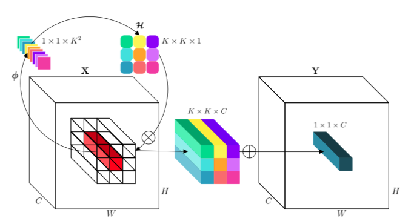

# involution_pytorch
Unofficial PyTorch implementation of "Involution: Inverting the Inherence of Convolution for Visual Recognition" by Li et al. presented at CVPR 2021.

<br />

[[`abs`](https://arxiv.org/abs/2103.06255), [`pdf`](https://arxiv.org/pdf/2103.06255.pdf), [`Yannic's Video`](https://www.youtube.com/watch?v=pH2jZun8MoY)]



## Installation

You can install `involution_pytorch` via `pip`:

```bash
pip install involution_pytorch
```

## Usage

You can use the `Inv2d` layer as you would with any PyTorch layer:

```python
import torch
from involution_pytorch import Inv2d

inv = Inv2d(
    channels=16,
    kernel_size=3,
    stride=1
)

x = torch.rand(1, 16, 32, 32)
y = inv(x) # [1, 16, 32, 32]
```

> The paper talks about using Self-Attention for the dynamic kernel generation function. I'll try implementing it later if time permits.

## Contributing

If I've made any errors anywhere in the implementation, please do let me know by raising an issue. If there's any cool addition you want to introduce, all PRs appreciated!

## License

[MIT](https://github.com/rish-16/involution_pytorch/blob/main/LICENSE)